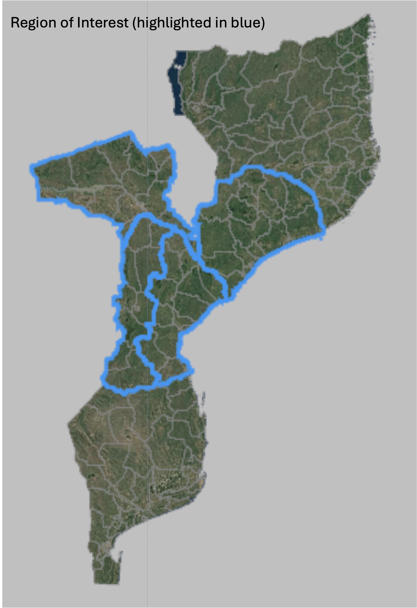
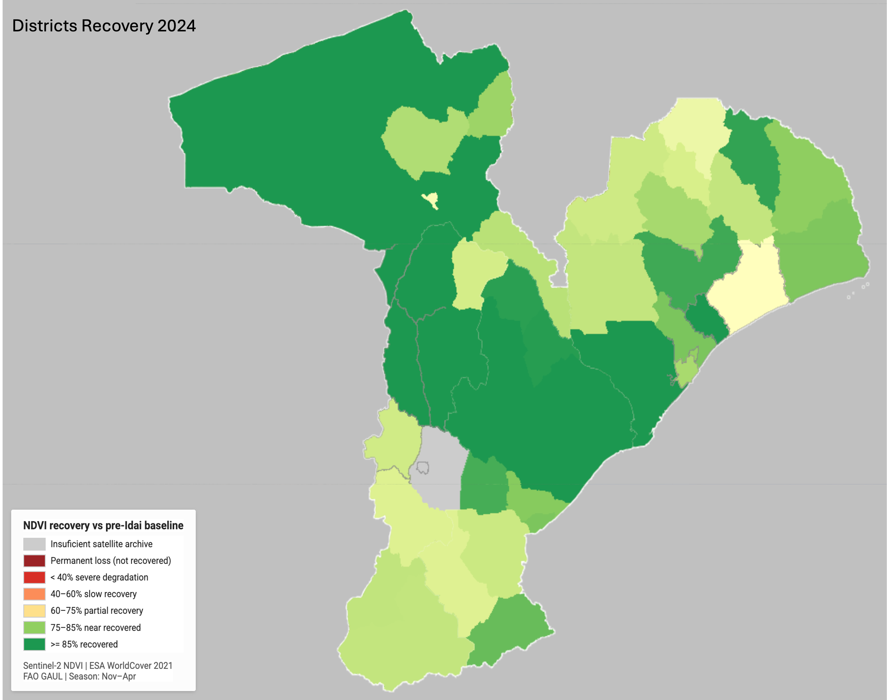

# Mozambique-Idai-Cropland
### Cropland Vulnerability and Post-Disaster Agricultural Recovery Assessment
#### Mapping the Impact of Cyclone Idai on Crop Production Capacity, 2017–2024

---

## Overview

This project applies satellite time-series analysis to assess the long-term impact of Cyclone Idai on cropland productivity across central and northern Mozambique. Using Sentinel-2 NDVI composites spanning eight growing seasons (2017–2024) and a fixed cropland mask derived from ESA WorldCover 2021, the analysis quantifies crop production recovery at both pixel and district level — producing sub-national evidence on agricultural resilience and persistent food security risk that conventional survey methods cannot provide at this spatial resolution.

Cyclone Idai made landfall near Beira on 15 March 2019, generating storm surges, prolonged inland flooding along the Buzi and Pungwe river systems, and widespread cropland inundation across Sofala, Manica, Zambezia, and Tete provinces. The storm is one of the most destructive tropical cyclones on record in the Southern Hemisphere. Its agricultural impact — both immediate and multi-year — has direct implications for food security across a population heavily dependent on subsistence rain-fed agriculture.

The analytical framework follows the established remote sensing approach for post-disaster agricultural assessment: a pre-event NDVI baseline is established from two full growing seasons, and recovery is tracked season by season against that baseline. Districts and pixels that fail to reach 85% of baseline productivity by the 2023–24 growing season are classified as exhibiting persistent degradation, representing cropland whose production capacity has not been restored five years after the event.

---

## Why This Is a Big Data Problem

Mapping cropland recovery across four provinces at 20-metre resolution, season by season for eight years, is not something you can do on a laptop. The numbers give a sense of the scale: roughly 180 million pixels per seasonal composite, seven composites computed, each drawing from hundreds of individual Sentinel-2 scenes after cloud filtering. The total volume of raw satellite imagery processed runs into the terabytes. What makes this tractable is Google Earth Engine's distributed compute infrastructure — the processing happens on Google's servers, not locally, with computations parallelised across the image archive in ways that would take weeks on conventional hardware.

But the big data dimension here goes beyond raw volume. The more interesting challenge is the analytical one: turning an unstructured archive of satellite observations — taken at different times, under different atmospheric conditions, across overlapping orbital paths — into a spatially coherent, temporally consistent time series that can actually support a finding about crop recovery. That requires cloud masking at the image level, median compositing across seasons to suppress noise, a fixed reference mask to ensure you are always measuring the same land, and a calibrated recovery threshold grounded in the literature. Each of these choices has a material effect on the result. Raising the cloud threshold from 30% to 60%, for example, would have included more imagery in coastal areas but introduced cloud contamination artefacts into the composites. The analysis involved diagnosing those tradeoffs directly — not just running a pipeline.

The output sits at the intersection of two areas where big data approaches have a genuine advantage over conventional methods. First, spatial granularity: a household survey cannot tell you which specific river valley patches never recovered; satellite data can. Second, temporal continuity: a single post-disaster assessment tells you what happened; a five-season time series tells you whether it got better and how fast. For food security applications in particular — where the question is not just "was there damage" but "has production capacity been restored" — that temporal dimension is what makes the analysis useful rather than merely descriptive.

---

## Study Area

The analysis covers four provinces in the Cyclone Idai impact zone: **Sofala**, **Manica**, **Zambezia**, and **Tete**. These provinces together contain the Beira agricultural corridor, the Zambezi basin agricultural lowlands, and the Manica highlands — three of Mozambique's most agriculturally productive zones.

All analysis is restricted to areas classified as cropland under ESA WorldCover 2021 (class 40), applied as a fixed mask throughout. The growing season is defined as November to April, corresponding to Mozambique's main rainy season and primary agricultural cycle.

---

## Methodology

**Baseline establishment:** A two-season pre-event NDVI baseline was computed from the 2016–17 and 2017–18 growing seasons (median Sentinel-2 composite per season, averaged across both years). The 2015–16 season was excluded after diagnostic testing confirmed zero valid Sentinel-2 observations in coastal areas of Zambezia during that period — a consequence of incomplete orbital coverage in Sentinel-2A's first operational year.

**Recovery metric:** Recovery ratio is computed per pixel as post-event NDVI divided by baseline NDVI. A recovery ratio of 1.0 indicates full return to pre-event productivity. The 85% threshold (ratio ≥ 0.85) is applied as the recovery criterion, consistent with the remote sensing literature on post-disaster agricultural assessment.

**Permanent loss classification:** Pixels where the recovery ratio remained below 0.85 across all five post-event growing seasons (2019–20 through 2023–24) are classified as exhibiting permanent cropland degradation.

**District aggregation:** Mean recovery ratios are computed per district using zonal statistics at 250m scale. Districts are classified into five recovery tiers based on their 2023–24 mean recovery ratio.

**Cloud masking:** Per-image cloud masking applied via Sentinel-2 QA60 bitmask (cloud and cirrus bands). Images with greater than 30% cloudy pixel percentage excluded from compositing.

---

## Key Findings

- Of 52 districts with valid cropland data, **35 (67%)** had recovered to at least 85% of pre-Idai baseline NDVI by the 2023–24 growing season.
- **16 districts (31%)** showed partial recovery (60–85% of baseline), concentrated in central Sofala and coastal Zambezia.
- **1 district (2%)** remained in the slow recovery tier (40–60%) five years post-event.
- No district averaged below 40% of baseline by 2024, indicating that aggregate district-level cropland productivity has largely — though not uniformly — recovered.
- At pixel level, the permanent loss layer reveals spatially concentrated patches of non-recovered cropland within otherwise recovering districts, particularly in the Buzi River valley and areas immediately inland from Beira. This sub-district spatial heterogeneity is not visible in district-level aggregates and represents the most actionable finding for targeted agricultural intervention.
- National mean growing-season rainfall declined 35% between 2017 (921mm) and 2024 (594mm) across southern Mozambique — a concurrent stress factor that may be suppressing full recovery in the most flood-affected districts.

---

## Visualisations

### Picture1 — Region of interest


### Picture5 — Cropland Mask (ESA WorldCover 2021, Class 40)


### Picture2 — NDVI Baseline 2017–2018 (Pre-Idai Cropland Productivity)


### Picture4 — Pixel-level NDVI Recovery Ratio 2023–24


### Picture3 — Permanent Cropland Loss with District Recovery Overlay


### Picture1 — District Recovery Choropleth (2023–24 Season)



---

## Data Sources

| Dataset | Description | Resolution | Source |
|---|---|---|---|
| Sentinel-2 SR Harmonized | Cloud-free growing-season median NDVI composites | 20 m | ESA / GEE |
| ESA WorldCover 2021 | Global land cover, class 40 = cropland (fixed mask) | 10 m | ESA / GEE |
| FAO GAUL 2015 | Administrative boundaries — provinces and districts | — | FAO / GEE |
| WorldPop 2020 | Population estimates (reference only) | 100 m | WorldPop / GEE |

---

## Repository Structure

```
Mozambique-Idai-Cropland/
│
├── Images/
│   ├── Picture1.png    District recovery choropleth 2023–24
│   ├── Picture2.png    NDVI baseline 2017–2018
│   ├── Picture3.png    Permanent loss with recovery overlay
│   ├── Picture4.png    Pixel-level recovery ratio 2023–24
│   └── Picture5.png    Cropland mask WorldCover 2021
│
├── mozambique_idai_v7.js    GEE analysis script
└── README.md
```

---

## Tools and Environment

All computation performed server-side in **Google Earth Engine** (Code Editor, JavaScript API). No local processing required. The analysis is fully reproducible with a registered GEE account.

| Component | Role |
|---|---|
| Sentinel-2 SR Harmonized | NDVI time-series compositing |
| ESA WorldCover v200 | Fixed cropland mask (class 40) |
| ee.Reducer.mean() | District zonal statistics |
| ee.ImageCollection.median() | Cloud-robust seasonal compositing |
| JRC Global Surface Water | Permanent water body exclusion |
| FAO GAUL level 2 | District boundary aggregation |

---

## Limitations

- **Satellite archive gap:** Two districts in coastal Zambezia returned null baseline NDVI values due to zero valid Sentinel-2 observations during the 2015–16 growing season — a consequence of incomplete orbital coverage in Sentinel-2A's first operational year. The baseline was shifted to 2017–18 to resolve this. One district in western Manica (approx. 33.6°E, 19.1°S) returned null values across all seasons due to a persistent Sentinel-2 orbital gap at the Zimbabwe border. These districts are displayed as no-data in the choropleth. All affected districts contain cropland per ESA WorldCover 2021 and represent a genuine satellite data gap, not an absence of agricultural land use.

- **Fixed cropland mask:** ESA WorldCover 2021 is used as a static mask for all years. Cropland conversion or abandonment between 2017 and 2021 is not captured; some pixels may have been cropland at the time of Idai but reclassified by 2021.

- **NDVI as a proxy:** NDVI measures vegetation greenness, not crop yield directly. Recovery in NDVI does not necessarily imply equivalent recovery in agricultural output, particularly where crop variety, planting timing, or input availability have changed post-event.

- **Administrative boundaries:** FAO GAUL 2015 boundaries are used. These predate administrative restructuring in parts of central Mozambique and may not precisely reflect current district boundaries.

- **Drought co-occurrence:** The 2019–2024 period includes both El Niño-associated drought years (particularly in southern Mozambique) and the second destructive cyclone event (Cyclone Kenneth, April 2019, northern Mozambique). Recovery trajectories in this analysis reflect the compound effect of these stressors, not Cyclone Idai in isolation.

---

## References

- Copernicus Sentinel-2 data (2017–2024), processed by ESA. Available via Google Earth Engine.
- Zanaga, D., et al. (2022). ESA WorldCover 10m 2021 v200. Zenodo. https://doi.org/10.5281/zenodo.7254221
- FAO. (2015). Global Administrative Unit Layers (GAUL). Food and Agriculture Organization of the United Nations.
- Henderson, J. V., Storeygard, A., & Weil, D. N. (2012). Measuring economic growth from outer space. *American Economic Review*, 102(2), 994–1028.
- ReliefWeb / OCHA. (2019). Mozambique: Cyclone Idai situation reports. United Nations Office for the Coordination of Humanitarian Affairs.
- World Food Programme. (2019). *Mozambique Cyclone Idai Emergency Response — Food Security Assessment*. WFP, Rome.

---

*Analysis conducted in Google Earth Engine. Growing season defined as November–April. Recovery threshold: 85% of pre-Idai baseline NDVI. All outputs in WGS84 (EPSG:4326).*
